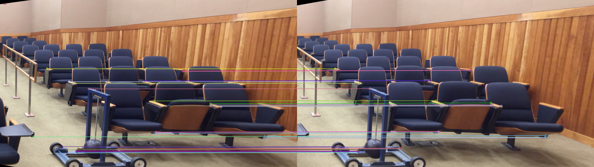
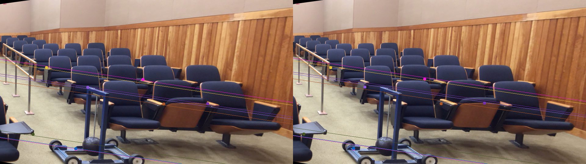
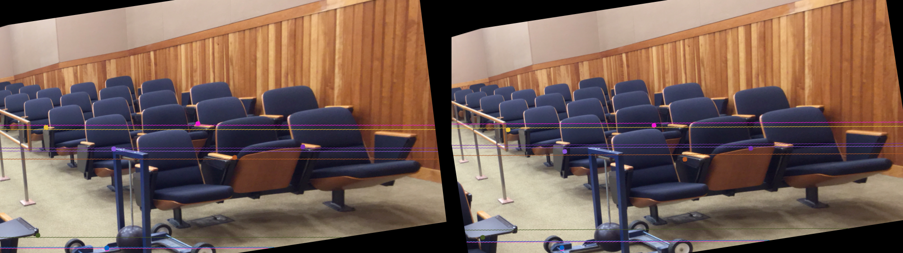
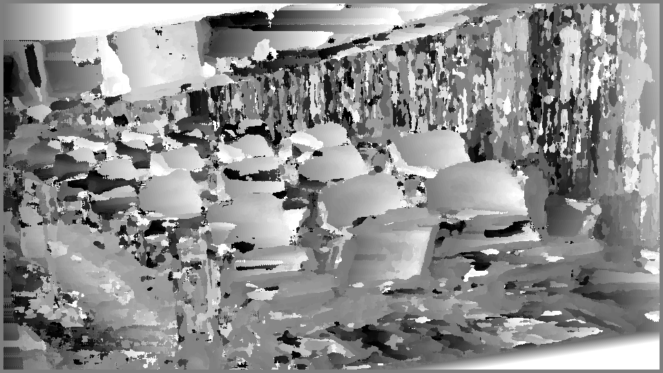
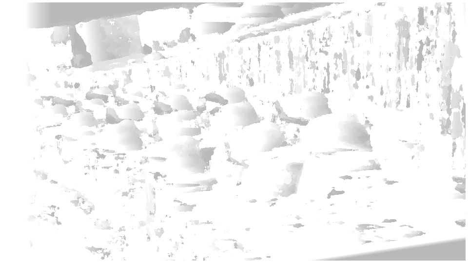
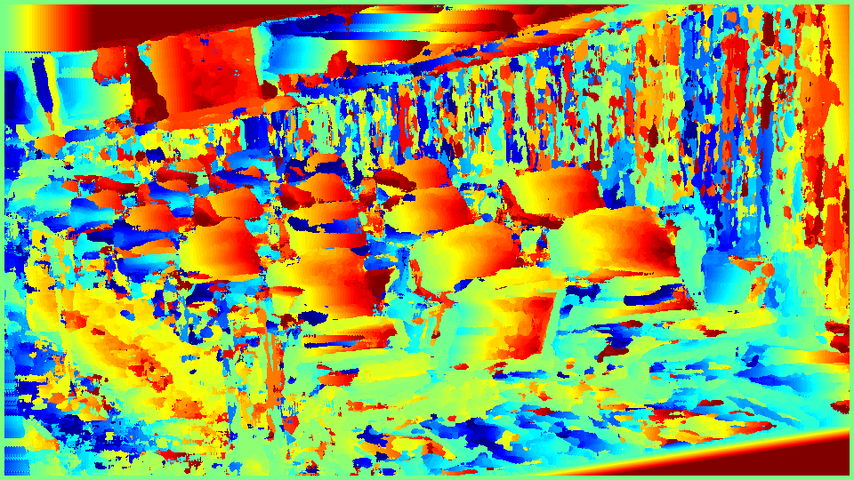
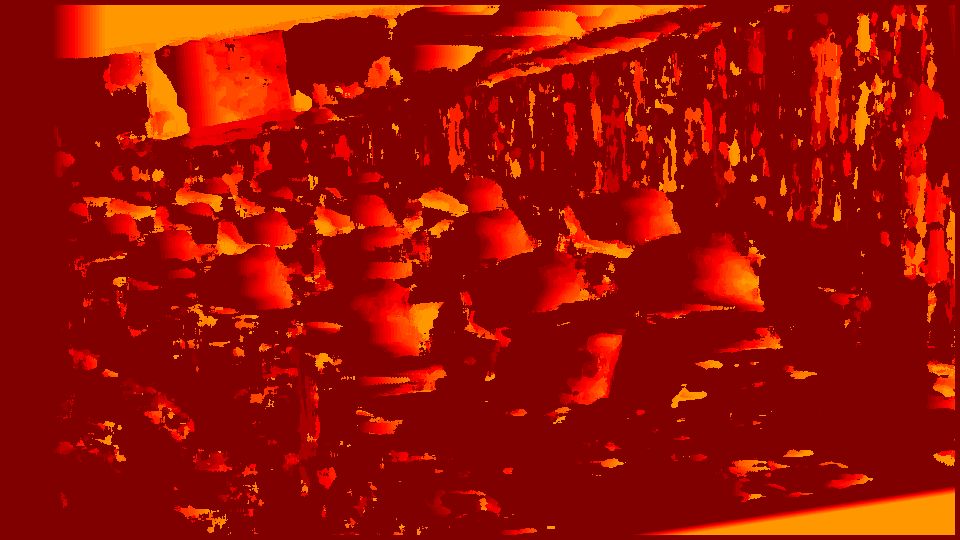

# Stereo Vision 

This project implements a stereo vision pipeline for reconstructing 3D scene geometry from stereo image pairs.

## Pipeline

- Feature extraction and matching between left and right images
- Fundamental matrix estimation with RANSAC
- Essential matrix computation from fundamental matrix 
- Recovery of rotation and translation matrices from essential matrix
- Rectification of image pairs using computed homographies
- Disparity calculation using window-based matching
- Depth map generation from disparity 

## Methodology

- Used SIFT for robust feature matching between images
- Leveraged epipolar geometry for stereo correspondence 
- Computed disparity using Sum of Squared Differences (SSD) window matching
- Validated depth maps qualitatively using colorizations

## Results

- Successfully reconstructed depth maps for Middlebury stereo datasets
- Estimated 3D structure of static scenes from stereo camera images
- Depth visualization provides intuition about scene geometry

- Matching features in left and right image

- Epipolar line corrosponding to the obtained matching feature

- Rectified epipolar lines

- Disparity and Depth map
  

- Disparity and Depth heat map

## Discussion 

- Careful calibration and rectification are crucial for accurate stereo matching
- Using more robust feature descriptors can improve disparity estimation
- Future work on incorporating temporal information for dynamic scenes

## References

[1] Scharstein et al., A Taxonomy and Evaluation of Dense Two-Frame Stereo Correspondence Algorithms
